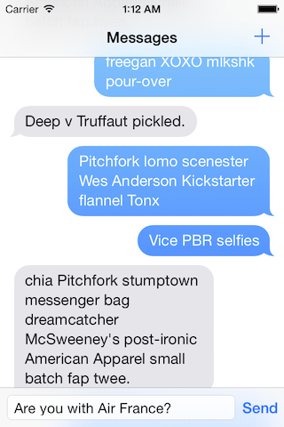

MSMessages
============================

A messaging UI for iOS based off the look and feel of Messages for iOS 7.

##### TODO #####
- [ ] Add UIKit Dynamics springs for messages
- [x] Clean up ViewModel/LayoutSpecs
- [ ] Fix message scrolling after a message is sent
- [ ] Timestamps
- [ ] Multimedia messages

##### HMU #####
You can get at me on twitter: [@mstultz](http://www.twitter.com/mstultz "@mstultz")
